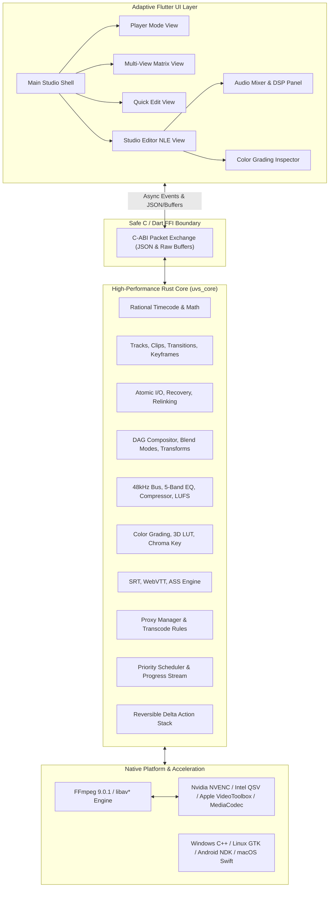

# System Architecture

Universal Video Studio (UVS) uses a layered, multi-engine architecture that cleanly decouples UI representation from high-throughput media processing, memory-bounded caching, and non-linear timeline mathematics.

---

## 1. High-Level Architecture Diagram

---

## 2. Thread and Execution Model

To guarantee the user interface never blocks or drops frames during playback, scrub, or heavy background export:

1. **UI Thread (Flutter Main Isolate)**:
   - Handles gesture input, user interactions, layout rendering, and widget animations.
   - Zero decoding or file I/O operations occur on this isolate.
2. **Core Computation Thread Pool (Rayon)**:
   - Parallel pixel composition, transform matrix calculations, 3D LUT interpolation, and biquad audio filtering run on a worker pool scaled to `logical_cpus`.
3. **Decoded Frame Cache Worker**:
   - Asynchronously pre-fetches and decodes video frames into a bounded LRU memory pool.
   - Enforces configurable RAM limits (256MB on Android, 1GB on Desktop) with instantaneous eviction.
4. **Background Render Queue Isolates**:
   - Independent background threads that spawn and supervise FFmpeg worker processes for project rendering, proxy generation, and batch transcode without contending with playback.

---

## 3. Safe FFI Boundary Specification

The FFI boundary uses standard C-ABI calling conventions:
* `uvs_core_version()`: Returns library build version string.
* `uvs_detect_hardware()`: Serializes detected GPU and hardware encoders to JSON.
* `uvs_project_new(name, width, height, fps_num, fps_den, drop_frame)`: Initializes project.
* `uvs_project_save_atomic(project_json, target_path)`: Atomically commits project to disk.
* `uvs_project_load(path)`: Loads, validates, and migrates `.uvsp` project files.
* `uvs_free_string(ptr)`: Reclaims allocated C-string buffers with zero memory leaks.
