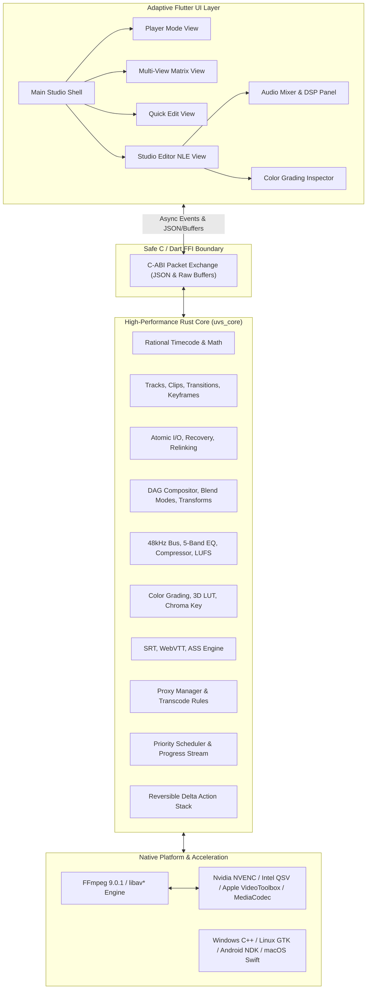

# System Architecture

Universal Video Studio (UVS) uses a layered, multi-engine architecture that cleanly decouples UI representation from high-throughput media processing, memory-bounded caching, and non-linear timeline mathematics.

---

## 1. High-Level Architecture Diagram

---

## 2. Thread and Execution Model

To guarantee the user interface never blocks or drops frames during playback, scrub, or heavy background export:

1. **UI Thread (Flutter Main Isolate)**:
   - Handles gesture input, user interactions, layout rendering, and widget animations.
   - Zero decoding or file I/O operations occur on this isolate.
2. **Core Computation Thread Pool (Rayon)**:
   - Parallel pixel composition, transform matrix calculations, 3D LUT interpolation, and biquad audio filtering run on a worker pool scaled to `logical_cpus`.
3. **Decoded Frame Cache Worker**:
   - Asynchronously pre-fetches and decodes video frames into a bounded LRU memory pool.
   - Enforces configurable RAM limits (256MB on Android, 1GB on Desktop) with instantaneous eviction.
4. **Background Render Queue Isolates**:
   - Independent background threads that spawn and supervise FFmpeg worker processes for project rendering, proxy generation, and batch transcode without contending with playback.

---

## 3. Safe FFI Boundary Specification

The FFI boundary uses standard C-ABI calling conventions (`extern "C"`) with mandatory `std::panic::catch_unwind` wrappers preventing panics from crossing the foreign boundary into the Dart runtime. Memory buffers allocated by Rust are freed via `uvs_free_string`.

### Core System & Lifecycle
* `uvs_core_version()`: Returns library build version string.
* `uvs_detect_hardware()`: Serializes detected GPU and hardware encoders (Intel QSV, NVENC, VideoToolbox, VAAPI, MediaCodec) to JSON.
* `uvs_project_new(name, width, height, fps_num, fps_den, drop_frame)`: Initializes new `.uvsp` project.
* `uvs_project_save_atomic(project_json, target_path)`: Atomically commits project via temp-write, fsync, and atomic rename.
* `uvs_project_load(path)`: Loads, validates, and migrates `.uvsp` project files.
* `uvs_project_relink(project_json, search_dirs_json)`: Resolves missing media assets across local directories.
* `uvs_free_string(ptr)`: Reclaims allocated C-string buffers with zero memory leaks.

### Multi-Track Timeline & Editing
* `uvs_timeline_add_track(project_json, kind, name)`: Appends video, audio, subtitle, or adjustment track.
* `uvs_timeline_add_clip(project_json, track_id, media_path, start_num, start_den, dur_num, dur_den, in_num, in_den)`: Adds media clip.
* `uvs_timeline_split_clip(project_json, clip_id, split_num, split_den)`: Splits clip into two non-destructive halves.
* `uvs_timeline_ripple_delete(project_json, clip_id)`: Deletes clip and ripples downstream clips to close gap.
* `uvs_timeline_trim_clip(project_json, clip_id, new_in_num, new_in_den, new_out_num, new_out_den)`: Trims clip in/out boundaries.
* `uvs_timeline_roll_edit(project_json, left_clip_id, right_clip_id, delta_num, delta_den)`: Rolls edit point between two adjacent clips.
* `uvs_timeline_slip_edit(project_json, clip_id, delta_num, delta_den)`: Slips source in/out while keeping timeline position fixed.
* `uvs_timeline_slide_edit(project_json, clip_id, delta_num, delta_den)`: Slides clip along timeline while adjusting neighboring clip boundaries.
* `uvs_timeline_set_speed(project_json, clip_id, speed, reverse)`: Adjusts playback speed factor and reverse flag.
* `uvs_timeline_link_clips(project_json, clip_ids_json)`: Locks multiple clips together for synchronized movement.
* `uvs_timeline_add_marker(project_json, time_num, time_den, name, color, comment)`: Places timeline marker.
* `uvs_timeline_delete_marker(project_json, marker_id)`: Removes timeline marker.

### Keyframing & Transitions
* `uvs_clip_add_keyframe(project_json, clip_id, property, time_num, time_den, value, curve)`: Inserts animated property keyframe.
* `uvs_clip_set_transition(project_json, clip_id, kind, duration_num, duration_den)`: Sets clip entrance/exit transition.

### Subtitles & Captions
* `uvs_subtitles_parse(content, format)`: Parses SRT, WebVTT, or ASS v4+ formatted subtitle files into structured cues.
* `uvs_subtitles_export(cues_json, format)`: Serializes subtitle cues to SRT, WebVTT, or ASS format.
* `uvs_subtitle_add_cue(project_json, track_id, start_num, start_den, end_num, end_den, text)`: Adds subtitle cue to timeline.

### Audio DSP, Waveforms & Multicam
* `uvs_waveform_summary(samples_ptr, sample_count, points)`: Extracts multi-resolution RMS/peak waveform data.
* `uvs_calculate_integrated_lufs(samples_ptr, sample_count, sample_rate)`: Computes ITU-R BS.1770 / EBU R128 integrated loudness.
* `uvs_detect_silence_segments(samples_ptr, sample_count, sample_rate, threshold_db, min_duration_sec)`: Detects silent intervals.
* `uvs_find_multicam_lag(samples_a_ptr, count_a, samples_b_ptr, count_b, max_lag)`: Waveform cross-correlation audio alignment.
* `uvs_multicam_commit_cuts(project_json, cuts_json)`: Commits angle switching edits into timeline clips.

### Video Monitor, Color, Decode & Render
* `uvs_apply_color_grading(rgba_ptr, width, height, exposure, contrast, saturation, temperature)`: Real-time pixel buffer color grading.
* `uvs_apply_chroma_key(rgba_ptr, width, height, key_r, key_g, key_b, tolerance, softness)`: Alpha-mask chroma keying.
* `uvs_media_probe(path)`: Deep container and stream metadata extraction.
* `uvs_decode_frame(path, time_num, time_den, width, height)`: Decodes single RGB frame for preview.
* `uvs_proxy_generate(source_path, target_path, width, height, bitrate_kbps)`: Background proxy generation.
* `uvs_build_render_command(project_json, output_path, preset, hw_accel)`: Builds deterministic FFmpeg render command.
* `uvs_execute_render(project_json, output_path, preset, hw_accel)`: Executes background render pipeline.

### Undo / Redo Engine
* `uvs_undo_stack_new()`: Creates isolated undo/redo history stack.
* `uvs_undo_stack_free(stack_ptr)`: Destroys undo stack.
* `uvs_undo_stack_can_undo(stack_ptr)` / `uvs_undo_stack_can_redo(stack_ptr)`: Inspects stack availability.
* `uvs_undo_stack_push(stack_ptr, project_json)`: Records new timeline mutation state.
* `uvs_undo_stack_undo(stack_ptr)` / `uvs_undo_stack_redo(stack_ptr)`: Traverses project history.

---

## 4. VideoMonitorSurface & Dual Preview Architecture

All visual monitors across Player Mode, Studio Editor (Source & Program monitors), Quick Edit, and Multi-View 3x3 tiles use `VideoMonitorSurface`:
1. **Real Media Stream**: Probes and decodes target video frames at playhead timecode using native FFI decoders or FFmpeg stream extraction.
2. **SMPTE Fallback Generator**: When media is loading, unlinked, or offline, renders standard broadcast SMPTE color bars with live timecode HUD overlays.
3. **Zero UI Thread Contention**: Preview decoding is decoupled from the main Flutter UI thread, rendering into cached memory buffers or texture surfaces.

