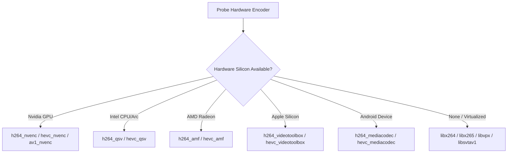

# Media Engine & FFmpeg Integration

Universal Video Studio leverages **FFmpeg 9.0.1** and **libav*** libraries to deliver hardware-accelerated video decoding, multi-track audio mixing, proxy generation, and high-efficiency export.

---

## 1. Hardware Acceleration Architecture

The media engine dynamically probes hardware acceleration features:



### Fallback Guarantee
If hardware encoder initialization fails (e.g. out of VRAM, unsupported profile, or containerized execution), the engine automatically falls back to software codecs with ultrafast presets without interrupting the user.

---

## 2. Proxy Generation & Cache Architecture

High-resolution media (4K, 6K, 8K) can strain mobile CPUs and integrated desktop GPUs during rapid multi-track scrubbing.

1. **Detection**: Media assets with width $> 1920$ or height $> 1080$ are marked for proxy generation.
2. **Background Transcode**:
   ```bash
   ffmpeg -y -i input_4k.mp4 -vf scale=1280:720 -c:v libx264 -preset ultrafast -crf 26 -c:a copy proxy_720p.mp4
   ```
3. **Seamless Preview**: In the editor and player, users can toggle "Use Proxies". Timeline scrubbing uses the lightweight 720p proxy with 0 latency.
4. **Original Master Export**: Final project export **always** decodes directly from original source media with full floating-point color accuracy.
